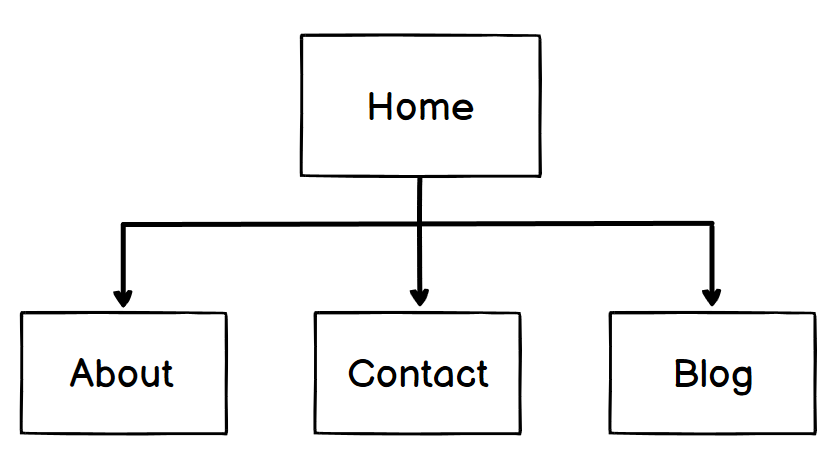
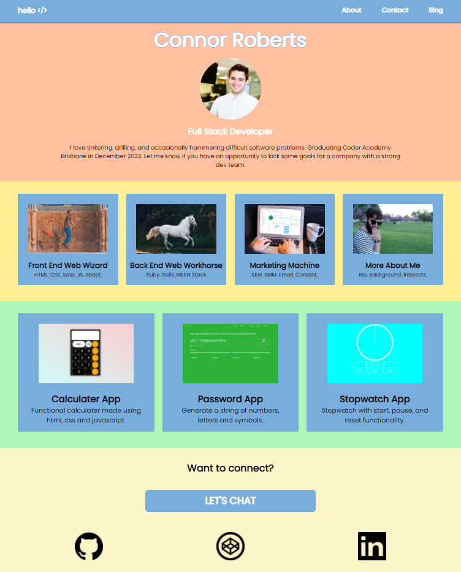
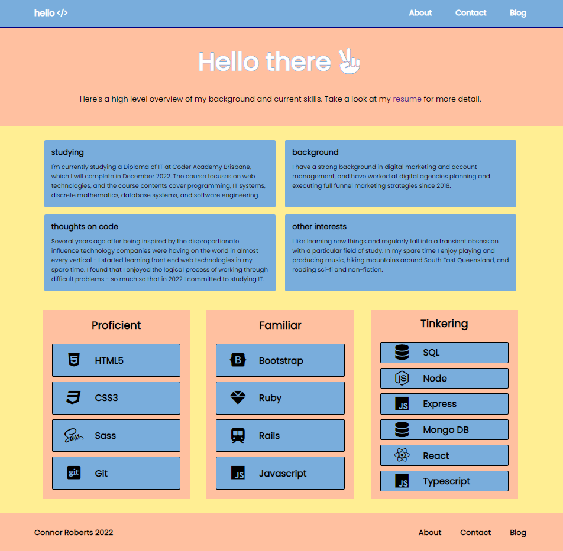
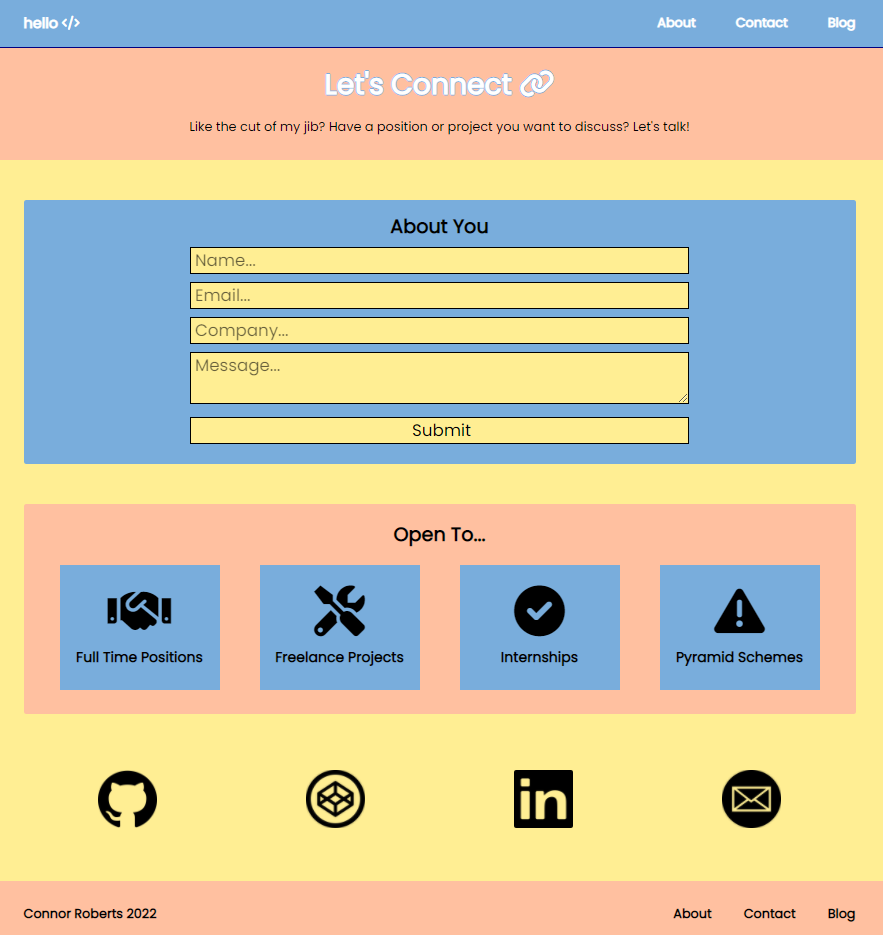
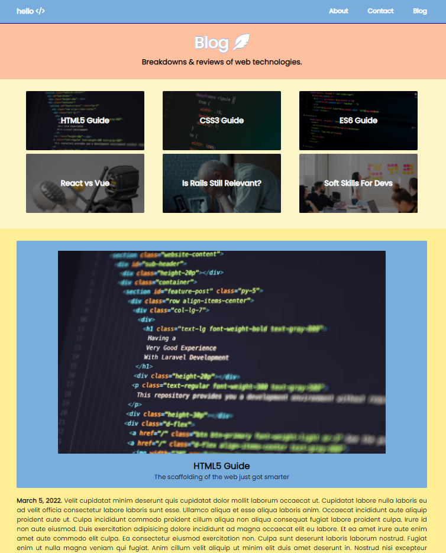

## Portfolio Site
[Site deployed on netlify]()https://quizzical-colden-2cf193.netlify.app/index.html ##Github repo 
Remote repo [available here]()https://github.com/connorca22/portfolio 

## Portfolio Description

### Purpose
The purpose of this website is to introduce myself and summarise both my background and professional experience to potential employers and recruiters, in order to further advance my chances of gaining employment in a junior developer role. The website build itself acts as a demonstration of my ability to ulitise front end technologies. I have also included links that help to contextualise my abilities and history (e.g. github, codepen, linkedin accounts), as well as biographical information that communicates my character and interests. 

### Functionality / Features
The website utilises flexbox and media breakpoints to be fully responsive. In terms of functionality and interactivity - the contact page contains a contact form where users can send enquiries directly to me, and the blog page contains blog navigation tiles that utilise the html attribute **onlick** to link div elements to the corresponding blog posts on the page. 
```
            <div class="container mobile">
                <div class="mob-article-link" onclick="location.href='#blog-one';" style="cursor: pointer;">HTML5 Guide</div>
                <div class="mob-article-link" onclick="location.href='#blog-two';" style="cursor: pointer;">CSS3 Guide</div>
                <div class="mob-article-link" onclick="location.href='#blog-three';" style="cursor: pointer;">ES6 Guide</div>
                <div class="mob-article-link" onclick="location.href='#blog-four';" style="cursor: pointer;">React vs Vue</div>
                <div class="mob-article-link" onclick="location.href='#blog-five';" style="cursor: pointer;">Is Rails Still Relevant?</div>
                <div class="mob-article-link" onclick="location.href='#blog-six';" style="cursor: pointer;">Soft Skills For Devs </div>
            </div>
```

### Target Audience
The target audience for the website is potential employers and recruiters in the web development space. 

### Tech Stack 
To build this portfolio website I utilised a html and css. I utilised git for version control, and github as a remote repository. Netlify was linked to the Github project in order to deploy the site. 

### Sitemap



## Web Page Screenshots

### Home Page


### About Page


### Contact Page


### Blog Page 
